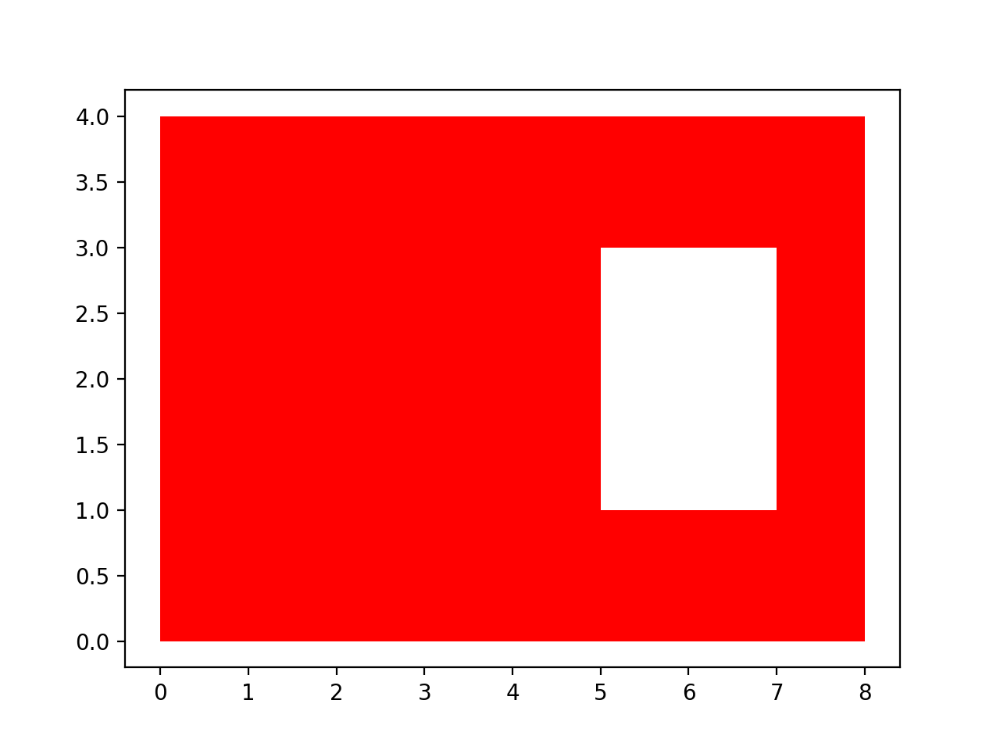

# BDDsets

## Install dependencies
```
python -m pip install -r requirements.txt
```

## Run an example

```
cd examples
python example_construction.py
```

This will open a plot window with something like this:
