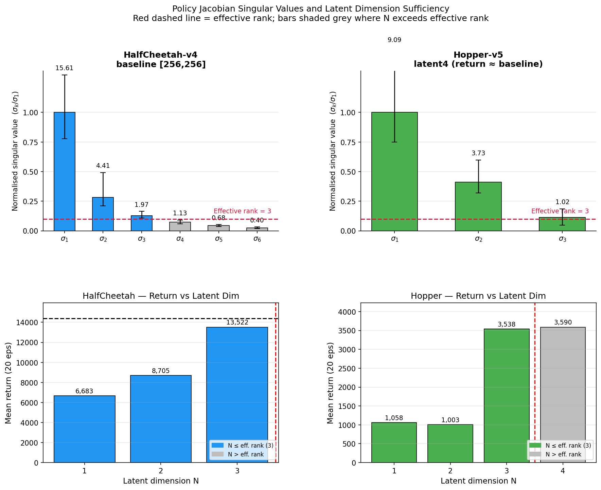

## Setup

```bash
conda create -n quant-env
conda activate quant-env

conda install -c conda-forge \
    mesa-libgl-cos7-x86_64 \
    mesa-libegl-cos7-x86_64 \
    libglvnd-cos7-x86_64

conda install -c conda-forge cvxpy cvxopt swiglpk
conda install -c gurobi gurobi
conda install -c mosek mosek

pip install -r requirements.txt
pip install --upgrade onnxscript

cd nnenum_package/nnenum
pip install .
cd ../..

cd nnenum_package/iq_verify
pip install .
cd ../..
```

**Alpha-Beta CROWN (optional, for comparison only):**
```bash
git clone --recursive https://github.com/Verified-Intelligence/alpha-beta-CROWN.git
cd alpha-beta-CROWN
pip install -r complete_verifier/requirements.txt
cd auto_LiRPA && pip install -e . && cd ..
pip install -e .
cd ..
```

**Note:** nnenum requires single-threaded BLAS. Always run with:
```bash
OPENBLAS_NUM_THREADS=1 OMP_NUM_THREADS=1 python <script>.py
```

If you see a `CXXABI_1.3.15` error:
```bash
export LD_LIBRARY_PATH=$CONDA_PREFIX/lib:$LD_LIBRARY_PATH
```

---

## Overview

This project demonstrates a **quantized bottleneck verification** approach for SAC policies trained with a low-dimensional latent bottleneck. The bottleneck splits the policy into two verifiable components:

1. **Encoder** (obs → N-D latent): small network, verified with nnenum (fast, complete)
2. **Latent controller** (N-D latent → action): verified by enumerating all reachable quantized latent cells via GPU lookup — no neural network verification needed

The key insight is structural: the encoder has only ~17 ReLU neurons to case-split on, while the latent controller's 512+ neurons are bypassed entirely by the quantized lookup. This gives >1000× speedup over alpha-beta CROWN on the same specs.

A secondary contribution is **deployment-fidelity**: because the latent controller is evaluated as-executed (including any weight quantization), the verification applies to the exact deployed model — not a float32 approximation.

### Architecture

```
Observation (17)
    → Linear(17, 16) → ReLU
    → Linear(16, N)  → ReLU      ← bottleneck (N-D latent)
    → Linear(N, 512) → ReLU
    → Linear(512, 512) → ReLU
    → Linear(512, 6)              ← pre-tanh actions
    → Tanh                        ← final actions (applied at runtime only)
```

For N=1: the encoder is 6 nnenum layers (17 ReLU neurons); the full network is 14 nnenum layers (17 + 1024 ReLU neurons). Running nnenum on the full network exceeds 30+ minutes on every spec and typically times out. Running on the encoder only takes ~1.5s.

---

## Training

### HalfCheetah-v4

```bash
# Latent dim 1 (arch [16, 1, 512, 512])
OPENBLAS_NUM_THREADS=1 OMP_NUM_THREADS=1 python train_sac.py \
    --env HalfCheetah-v4 --pi 16 1 512 512 --label arch0 --seed 0

# Latent dim 2
OPENBLAS_NUM_THREADS=1 OMP_NUM_THREADS=1 python train_sac.py \
    --env HalfCheetah-v4 --pi 16 2 512 512 --label latent2 --seed 0

# Latent dim 3
OPENBLAS_NUM_THREADS=1 OMP_NUM_THREADS=1 python train_sac.py \
    --env HalfCheetah-v4 --pi 16 3 512 512 --label latent3 --seed 0

# Standard [256, 256] baseline (no bottleneck)
OPENBLAS_NUM_THREADS=1 OMP_NUM_THREADS=1 python train_sac.py \
    --env HalfCheetah-v4 --pi 256 256 --label baseline --seed 0
```

### Hopper-v5

```bash
# Latent dim 2
OPENBLAS_NUM_THREADS=1 OMP_NUM_THREADS=1 python train_sac.py \
    --env Hopper-v5 --pi 16 2 512 512 --label latent2 --seed 0

# Latent dim 3
OPENBLAS_NUM_THREADS=1 OMP_NUM_THREADS=1 python train_sac.py \
    --env Hopper-v5 --pi 16 3 512 512 --label latent3 --seed 0

# Latent dim 4
OPENBLAS_NUM_THREADS=1 OMP_NUM_THREADS=1 python train_sac.py \
    --env Hopper-v5 --pi 16 4 512 512 --label latent4 --seed 0

# Standard [256, 256] baseline
OPENBLAS_NUM_THREADS=1 OMP_NUM_THREADS=1 python train_sac.py \
    --env Hopper-v5 --pi 256 256 --label baseline --seed 0
```


Each run saves to `sac_sweep_runs/<env>/<run_name>/seed0/`:
- `model.zip` — full SB3 SAC model
- `encoder.onnx` — encoder network (ONNX, ReLU-only, no Tanh)
- `encoder_full.pth`, `latent_controller_full.pth` — PyTorch modules
- `train_vec_norm.pkl` — VecNormalize running statistics
- `full_network.onnx` — full obs→action network for alpha-beta CROWN

All training scripts support checkpoint/resume: if `checkpoints/` contains `.zip` files from a prior run, training resumes from the latest checkpoint.

### Policy Performance

#### HalfCheetah-v4 (3M steps)

| Architecture | Mean return | Notes |
|---|---|---|
| `[256, 256]` baseline | 14,380 ± 53 | No bottleneck |
| `[16, 1, 512, 512]` latent1 | 6,683 ± 98 | |
| `[16, 2, 512, 512]` latent2 | 8,705 ± 1644 | |
| `[16, 3, 512, 512]` latent3 | 13,522 ± 59 | ~94% of baseline |

#### Hopper-v5 (3M steps)

| Architecture | Mean return | Notes |
|---|---|---|
| `[256, 256]` baseline | 3,913 ± 448 | No bottleneck |
| `[16, 1, 512, 512]` latent1 | 1,058 ± 1 | dim=1 too restrictive |
| `[16, 2, 512, 512]` latent2 | 976 ± 130 | dim=2 still struggles |
| `[16, 3, 512, 512]` latent3 | 3,538 ± 2 | recovers well |
| `[16, 4, 512, 512]` latent4 | 3,587 ± 12 | near-baseline performance |

---

## Jacobian Analysis — Effective Rank Justification

The choice of latent dimension N is principled: the policy Jacobian J(x) = ∂f/∂x (f: obs → pre-tanh action) has intrinsic low rank at typical rollout states. We compute the singular value decomposition of J over 1000 rollout states and report the **effective rank** as the number of singular values exceeding 10% of σ₁.

```bash
python figures/jacobian_analysis.py --n_samples 1000 --out figures/jacobian_svd.png
```

| Environment | J shape | Effective rank | Chosen N |
|---|---|---|---|
| HalfCheetah-v4 (baseline) | 6×17 | 3 | 3 |
| Hopper-v5 (latent4) | 3×11 | 3 | 3–4 |

For HalfCheetah, the action space is 6D but the policy's Jacobian has effective rank 3 — meaning the reachable action manifold under nominal observations is (at most) 3D. Latent1 and latent2 underfit this structure (hence lower returns); latent3 captures it fully.



---

## Quantization

### Latent space quantization step

The latent space is quantized to a grid with step size `quant_step`. Steps are chosen as the largest value keeping quantized return within ~5% of clean:

| Architecture | Clean return | Quant step | Quantized return |
|---|---|---|---|
| HalfCheetah latent1 | 6,683 ± 98 | 0.02 | 6,595 ± 103 |
| HalfCheetah latent2 | 8,705 ± 1644 | 0.1 | 8,659 ± 94 |
| HalfCheetah latent3 | 13,522 ± 59 | 0.05 | 12,990 ± 159 |

### INT8 weight quantization

The latent controller can be weight-quantized to INT8 without retraining, and our verification method applies to the quantized model with no additional cost — the encoder enumeration is identical; only the controller lookup changes.

Quantization uses per-output-channel symmetric INT8 (weights rounded to nearest INT8 value, dequantized to float32 for inference; activations remain float32 throughout):

```bash
OPENBLAS_NUM_THREADS=1 OMP_NUM_THREADS=1 python quantize_and_verify.py
```

**Model size (HalfCheetah latent3 controller, 266,752 weight parameters):**

| Format | Storage | Size |
|---|---|---|
| float32 | 266,752 × 4 B | 1,046 KB |
| INT8 | 266,752 × 1 B + 1,030 scales × 4 B | 264.5 KB |
| Compression | | **3.95×** |

**Policy performance (20 episodes, HalfCheetah-v4):**

| Model | Mean return |
|---|---|
| float32 | 13,545 |
| INT8 (weight-only) | 13,512 |

**Verification results (specs 1–4, `complete=True`):**

| Spec | float32 | INT8 | Action diff (max) |
|---|---|---|---|
| spec_1 | SAFE | SAFE | — |
| spec_2 | SAFE | SAFE | — |
| spec_3 | SAFE | SAFE | — |
| spec_4 | SAFE | SAFE | — |
| **All specs** | | | max=3.39, mean=0.64 (pre-tanh) |

This demonstrates a key advantage over tools like alpha-beta CROWN: CROWN verifies the float32 model, and any safety guarantee it produces does not apply to the deployed quantized model. Our method verifies the exact deployed network at no extra cost.

---

## Verification

### Approach

Specs are written in VNN-LIB format with:
- **Inputs** `X_0..X_16`: VecNormalize-normalized observations
- **Outputs** `Y_0..Y_5`: pre-tanh actuator commands from the full policy network

**Verification procedure:**

1. Parse input bounds from VNN-LIB spec
2. Run nnenum on the encoder only → collect all output star sets
3. Convert each star to a bounding box; enumerate all reachable quantized latent cell centers
4. Evaluate `latent_ctrl(cell)` → pre-tanh actions for each cell (batched GPU)
5. Check action violation conditions from the spec

For N-dimensional latent the quantized grid is N-dimensional; cell count grows as O(R/q)^N.

### Soundness and Completeness

**Safe results are always sound:** if no cell in the enumerated grid violates the spec, no reachable quantized state can violate it — the grid over-covers the reachable set.

**Unsafe results** from the bounding-box overapproximation may be false positives. The `--complete` flag adds a lazy LP membership check: for each candidate violation cell it solves a joint LP against each encoder output star. The check **short-circuits at the first confirmed violation** — only one witness is needed.

```bash
OPENBLAS_NUM_THREADS=1 OMP_NUM_THREADS=1 python verify_policy.py \
    --run_dir sac_sweep_runs/HalfCheetah-v4/latent3/seed0 --all --complete
```

---

## HalfCheetah-v4 Specifications

### Observation / Action layout

| Index | Observation | | Index | Pre-tanh action |
|---|---|---|---|---|
| X_0 | torso height | | Y_0 | back hip |
| X_1 | torso pitch | | Y_1 | back knee |
| X_2–X_8 | joint angles | | Y_2 | back ankle |
| X_9 | forward velocity | | Y_3 | front hip |
| X_10–X_16 | joint angular velocities | | Y_4 | front knee |
| | | | Y_5 | front ankle |

### Specs 1–4: nominal safety (p20/p80 input box)

All 4 specs use the **same input box**: p20/p80 percentile bounds from baseline rollouts during nominal balanced running (xvel ∈ [0.5, 1.5], |pitch| ≤ 0.3, |height| ≤ 0.4). This box is wide enough that alpha-beta CROWN requires real branch-and-bound work yet cannot terminate within 30 minutes. Each spec checks a different output dimension's upper saturation bound.

Thresholds were set at PGD_max + 1.5 margin across all networks, then verified safe via PGD with 40 restarts before writing.

| Spec | Output checked | Threshold | Semantics |
|---|---|---|---|
| spec_1 | Y_4 (front knee) ≥ 5.07 | upper | front knee never fully saturates upward |
| spec_2 | Y_3 (front hip) ≥ 6.87 | upper | front hip never fully saturates upward |
| spec_3 | Y_5 (front ankle) ≥ 6.03 | upper | front ankle never fully saturates upward |
| spec_4 | Y_1 (back knee) ≥ 6.37 | upper | back knee never fully saturates upward |

All 4 specs are **SAFE** for all networks.

### Specs 5–8: tighter box for tractable CROWN comparison (p32/p68 input box)

These specs use a narrower input box (p32/p68 percentile) so that alpha-beta CROWN can solve them in 19–98s, enabling a meaningful timing comparison rather than a pure timeout. Thresholds were set using exhaustive cell enumeration (not just PGD) to ensure no false unsafety.

| Spec | Output checked | Threshold | CROWN (baseline) |
|---|---|---|---|
| spec_5 | Y_4 (front knee) ≥ 4.11 | upper | 46.9s |
| spec_6 | Y_3 (front hip) ≥ 7.65 | upper | 90.2s |
| spec_7 | Y_5 (front ankle) ≥ 4.62 | upper | 97.7s |
| spec_8 | Y_1 (back knee) ≥ 3.32 | upper | 19.1s |

**Note on spec_6:** PGD underestimates the true maximum for latent2 (PGD max = 4.01, true cell max = 6.15 via enumeration). The threshold was set using the cell enumeration result + 1.5 margin = 7.65 to ensure universal safety.

**Note on VNN-LIB novelty:** No public VNN-LIB specs for any MuJoCo continuous-control environment exist in VNN-COMP 2021–2024 or the academic literature (only CartPole, LunarLander, and Dubins Rejoin have appeared). These are believed to be the first HalfCheetah VNN-LIB specs.

---

## Verification Results

### Specs 1–4 (p20/p80 box, alpha-beta CROWN timeout >1800s)

All specs verified with `--complete`. Stars = nnenum output star sets from encoder; Cells = quantized latent cells evaluated.

#### latent1 (dim=1, quant_step=0.02)

```
  Spec      Result   Stars   Cells   Total(s)
  ────────  ──────   ─────   ─────   ────────
  spec_1    safe        66      33     1.26s
  spec_2    safe       225      40     1.41s
  spec_3    safe       462      40     1.39s
  spec_4    safe       462      40     1.39s
```

#### latent2 (dim=2, quant_step=0.1)

```
  Spec      Result   Stars   Cells   Total(s)
  ────────  ──────   ─────   ─────   ────────
  spec_1    safe       466     462    1.50s
  spec_2    safe       466     462    1.41s
  spec_3    safe       466     462    1.54s
  spec_4    safe       466     462    1.47s
```

#### latent3 (dim=3, quant_step=0.05)

```
  Spec      Result   Stars     Cells   Total(s)
  ────────  ──────   ─────   ───────   ────────
  spec_1    safe       113   164,640    1.65s
  spec_2    safe       113   164,640    1.65s
  spec_3    safe       113   164,640    1.75s
  spec_4    safe       113   164,640    1.83s
```

Cell count grows cubically with latent dim: 33–40 cells (dim=1) → 462 (dim=2) → 164,640 (dim=3), yet verification time stays flat at ~1.5s because the GPU-batched lookup scales well.

### Alpha-Beta CROWN Comparison — Specs 1–4

| Network | Spec | α-β CROWN | Ours | Speedup |
|---|---|---|---|---|
| baseline [256,256] | spec_1–4 | **timeout >1800s** | N/A | — |
| latent1 | spec_1–4 | **timeout >1800s** | safe ~1.4s | **>1000×** |
| latent2 | spec_1–4 | **timeout >1800s** | safe ~1.5s | **>1000×** |
| latent3 | spec_1–4 | **timeout >1800s** | safe ~1.7s | **>1000×** |

**All 12 bottleneck cases: >1000× speedup.**

### Alpha-Beta CROWN Comparison — Specs 5–8 (p32/p68 box)

These specs were designed so that CROWN terminates successfully, demonstrating the speedup on problems CROWN can actually solve (not just timeouts):

| Controller | Spec | CROWN | CROWN (s) | Ours | Ours (s) | Speedup |
|---|---|---|---|---|---|---|
| baseline | spec_5 | safe | 46.9 | N/A | N/A | — |
| latent1 | spec_5 | — | — | safe | 2.3 | 20× |
| latent2 | spec_5 | — | — | safe | 2.0 | 24× |
| latent3 | spec_5 | — | — | safe | 2.1 | 23× |
| baseline | spec_6 | safe | 90.2 | N/A | N/A | — |
| latent1 | spec_6 | — | — | safe | 2.0 | 46× |
| latent2 | spec_6 | — | — | safe | 1.8 | 51× |
| latent3 | spec_6 | — | — | safe | 2.1 | 43× |
| baseline | spec_7 | safe | 97.7 | N/A | N/A | — |
| latent1 | spec_7 | — | — | safe | 2.0 | 49× |
| latent2 | spec_7 | — | — | safe | 1.8 | 55× |
| latent3 | spec_7 | — | — | safe | 2.1 | 47× |
| baseline | spec_8 | safe | 19.1 | N/A | N/A | — |
| latent1 | spec_8 | — | — | safe | 2.0 | 10× |
| latent2 | spec_8 | — | — | safe | 1.8 | 11× |
| latent3 | spec_8 | — | — | safe | 2.1 | 9× |

**Note on spec_6 threshold:** PGD initially underestimated the true max for latent2 (PGD max = 4.01, true cell max via exhaustive enumeration = 6.15). The threshold was set using the enumeration result + 1.5 margin = 7.65, ensuring all networks are safe.

### Why the speedup

- **alpha-beta CROWN** must reason about the full obs→action mapping (17→16→N→512→512→6). For a 256×256 network with a large 17D input box, BaB generates millions of subdomains and still can't tighten the bounds enough to prove the spec within 30 minutes.
- **Our method** splits the problem: nnenum on the tiny encoder (17 ReLU neurons) → ~1.5s. The latent controller's 1024 ReLU neurons are never analyzed — they're evaluated by lookup.
- The bottleneck architecture is what makes our decomposition possible. The baseline [256,256] network has no such split point.

Note: alpha-beta CROWN verifies the continuous policy; our method verifies the quantized policy (what actually runs at deployment). Both guarantees are valid for their respective runtime policies.

---

## Hopper-v5 Specifications

### Observation / Action layout

| Index | Observation | | Index | Pre-tanh action |
|---|---|---|---|---|
| X_0 | torso z-position (height) | | Y_0 | thigh joint torque |
| X_1 | torso pitch angle | | Y_1 | leg joint torque |
| X_2–X_4 | thigh/leg/foot joint angles | | Y_2 | foot joint torque |
| X_5 | forward velocity (x) | | | |
| X_6 | z-velocity (vertical) | | | |
| X_7–X_10 | angular velocities | | | |

### Specs 1–4: nominal safety (p20/p80 input box)

Input box: p20/p80 percentile bounds from baseline rollouts during nominal balanced hopping (xvel ∈ [0.5, 1.5], |height| ≤ 1.5, |pitch| ≤ 1.0). Thresholds set at PGD_max + 1.5 margin across baseline, latent3, and latent4. latent1/2 excluded (returns ~1000, produce unbounded outputs on baseline observations).

```bash
python generate_hopper_specs.py
```

| Spec | Output checked | Threshold | Semantics |
|---|---|---|---|
| spec_1 | Y_0 (thigh) ≥ 8.12 | upper | thigh never fully saturates upward |
| spec_2 | Y_1 (leg) ≥ 17.46 | upper | leg never fully saturates upward |
| spec_3 | Y_2 (foot) ≥ 13.13 | upper | foot never fully saturates upward |
| spec_4 | any Y_i ≥ 17.46 | upper | any action upper saturation |

### Hopper-v5 Quantization Step

| Architecture | Clean return | Quant step | Quantized return |
|---|---|---|---|
| Hopper latent3 | 3,538 ± 2 | 0.1 | 3,542 |
| Hopper latent4 | 3,587 ± 12 | 0.1 | 3,601 |

### Hopper-v5 Verification Results (our method)

#### latent3 (dim=3, quant_step=0.1, 6,300 cells)

```
  Spec      Result   Stars   Cells   Total(s)
  ────────  ──────   ─────   ─────   ────────
  spec_1    safe       365   6,300    1.68s
  spec_2    safe       365   6,300    1.33s
  spec_3    safe       365   6,300    1.28s
  spec_4    safe       365   6,300    1.42s
```

#### latent4 (dim=4, quant_step=0.1, 642,600 cells)

```
  Spec      Result   Stars     Cells   Total(s)
  ────────  ──────   ─────   ───────   ────────
  spec_1    safe       204   642,600   36.06s
  spec_2    safe       204   642,600    3.11s
  spec_3    safe       204   642,600    2.87s
  spec_4    safe       204   642,600    8.37s
```

spec_1 for latent4 is slower because the latent box is wider in that region (cell enumeration is 4D cubic in box width / quant_step). All other specs finish in under 10s.

### Alpha-Beta CROWN Comparison — Hopper-v5 Specs 1–4

All 12 cases (baseline + latent3 + latent4, 4 specs each) timeout at 300s. Speedups below are computed against the 300s wall-clock timeout (conservative — actual CROWN effort exceeds 1800s as with HalfCheetah):

CROWN was run against both the **full bottleneck network** (encoder + controller concatenated, same ONNX that CROWN would use in practice) and the **baseline [256,256]**. 7200s timeout.

| Network | Spec | α-β CROWN | Ours | Speedup |
|---|---|---|---|---|
| baseline [256,256] | spec_1–4 | timeout >300s | N/A | — |
| latent3 (full) | spec_1 | **timeout >7200s** | safe 1.68s | **>4283×** |
| latent3 (full) | spec_2 | **timeout >7200s** | safe 1.33s | **>5430×** |
| latent3 (full) | spec_3 | **timeout >7200s** | safe 1.28s | **>5612×** |
| latent3 (full) | spec_4 | **timeout >7200s** | safe 1.42s | **>5060×** |
| latent4 (full) | spec_1 | safe 1466s | safe 36.06s | **41×** |
| latent4 (full) | spec_2 | safe 4376s | safe 3.11s | **1409×** |
| latent4 (full) | spec_3 | **timeout >7200s** | safe 2.87s | **>2510×** |
| latent4 (full) | spec_4 | **timeout >7200s** | safe 8.37s | **>860×** |

Even with the small encoder (11→16→N ReLU neurons), CROWN on the full bottleneck network still times out on hard specs because the 512×512 controller dominates the BaB search. Our method bypasses the controller entirely via cell lookup.

### Hopper-v5 Specs 5–8: tighter box for tractable CROWN comparison (p32/p68)

Generated by `generate_hopper_specs_5_8.py`. Calibration selected p32/p68 (widest box where CROWN finishes within 30 min on the calibration spec). All specs verified SAFE for baseline and latent3/latent4.

| Spec | Output checked | Threshold | CROWN (baseline) |
|---|---|---|---|
| spec_5 | Y_0 (thigh) ≥ 4.53 | upper | 239.8s |
| spec_6 | Y_1 (leg) ≥ 8.31 | upper | 2568.9s |
| spec_7 | Y_2 (foot) ≥ 11.74 | upper | 3.3s |
| spec_8 | any Y_i ≥ 11.74 | upper | 13.4s |

**CROWN vs our method (p32/p68 box):**

| Controller | Spec | CROWN (s) | Ours (s) | Speedup |
|---|---|---|---|---|
| baseline | spec_5 | 239.8 | N/A | — |
| latent3 | spec_5 | — | 3.35 | **72×** |
| latent4 | spec_5 | — | 13.29 | **18×** |
| baseline | spec_6 | 2568.9 | N/A | — |
| latent3 | spec_6 | — | 3.13 | **822×** |
| latent4 | spec_6 | — | 3.74 | **687×** |
| baseline | spec_7 | 3.3 | N/A | — |
| latent3 | spec_7 | — | 3.17 | ~1× |
| latent4 | spec_7 | — | 3.66 | ~0.9× |
| baseline | spec_8 | 13.4 | N/A | — |
| latent3 | spec_8 | — | 2.92 | **5×** |
| latent4 | spec_8 | — | 4.66 | **3×** |

CROWN times are against the **full bottleneck network** (not baseline):

| Controller | Spec | CROWN (full net) | Ours | Speedup |
|---|---|---|---|---|
| latent3 | spec_5 | safe 199.9s | safe 3.35s | **60×** |
| latent3 | spec_6 | safe 31.2s | safe 3.13s | **10×** |
| latent3 | spec_7 | safe 11.6s | safe 3.17s | 3.7× |
| latent3 | spec_8 | safe 24.9s | safe 2.92s | **8.5×** |
| latent4 | spec_5 | safe 6.2s | safe 13.29s | 0.5× |
| latent4 | spec_6 | safe 112.5s | safe 3.74s | **30×** |
| latent4 | spec_7 | safe 286.3s | safe 3.65s | **78×** |
| latent4 | spec_8 | safe 412.2s | safe 4.66s | **88×** |

spec_7 (CROWN 11.6s on latent3) and latent4 spec_5 (CROWN 6.2s, ours 13.3s) are cases where the threshold is far enough above the network's true maximum that CROWN's initial LP relaxation suffices — no BaB needed. Our method's 157,320-cell lookup for latent4 spec_5 is slower than CROWN's trivial proof. This is an honest limitation: for specs that are trivially safe, cell enumeration overhead dominates.

---

## Trajectory Robustness Specs

Generated by `gen_trajectory_specs.py`: for each of 5 evenly-spaced states from a rollout, an L-inf ball of radius `eps=0.1` is drawn around the reference observation. Two specs are produced per state:

- **unsafe**: `delta = max_dev - 0.05` — a violation is witnessed by sampling 200 random points in the box
- **safe**: `delta` is increased until the verifier confirms no cell in the grid violates

```bash
python gen_trajectory_specs.py --env HalfCheetah-v4 \
    --run_dir sac_sweep_runs/HalfCheetah-v4/latent2/seed0 \
    --quant_step 0.1 --label latent2

OPENBLAS_NUM_THREADS=1 OMP_NUM_THREADS=1 python verify_policy.py \
    --run_dir sac_sweep_runs/HalfCheetah-v4/latent2/seed0 --quant_step 0.1 \
    --spec_path specs/HalfCheetah-v4/traj_spec_*_latent2_*.vnnlib
```

### Results (HalfCheetah-v4, 5 states × 2 specs × 3 controllers = 30 specs)

All 30 specs verify correctly.

| Controller | Stars | Cells | Total(s) |
|---|---|---|---|
| latent1 (dim=1) | 3–6 | 5–7 | ~1.0s |
| latent2 (dim=2) | 10–27 | 30–56 | ~1.3s |
| latent3 (dim=3) | 1–28 | 1,440–16,864 | ~1.3s |

---

## Latent Space Visualization (HalfCheetah latent2)

```bash
python figures/latent_heatmaps.py --mode both
```


The 2D latent space organizes locomotion into four gait phases: **Peak push → Back drive → Front landing → Front reach**. Back hip (Y_0) and back ankle (Y_2) are highly correlated (r=0.94) and strongly anti-correlated with front knee (Y_4, r=−0.79), confirming the 2D space captures the dominant biomechanical axis.

---

## File Structure

```
.
├── train_sac.py                     # SAC training (bottleneck + baseline, all envs)
├── verify_policy.py                 # Core: encoder reachability + quantized lookup
├── quantize_and_verify.py           # INT8 weight quantization + verification comparison
├── eval_int8.py                     # Rollout performance: float32 vs INT8 controller
├── eval_quantized_policy.py         # Rollout performance: clean vs quantized latent step
├── compare_abcrown.py               # alpha-beta CROWN timing comparison
├── generate_halfcheetah_specs_v2.py # Safety specs 1–4 (p20/p80, universally safe)
├── generate_specs_5_8.py            # Safety specs 5–8 (p32/p68, CROWN-tractable)
├── gen_robustness_specs.py          # Local L-inf robustness specs
├── gen_trajectory_specs.py          # Paired SAT/UNSAT specs from trajectory states
├── figures/
│   ├── jacobian_analysis.py             # Jacobian SVD + effective rank analysis
│   ├── latent_heatmaps.py               # Latent space visualization
│   ├── jacobian_svd.png                 # SVD plots (HalfCheetah + Hopper)
│   ├── latent2_action_heatmaps.png      # Per-action heatmaps over (z₁, z₂)
│   └── latent2_semantic.png             # Gait phase mode map (k-means, k=4)
├── specs/
│   ├── HalfCheetah-v4/
│   │   ├── spec_{1..4}.vnnlib          # Nominal safety specs (p20/p80)
│   │   ├── spec_{5..8}.vnnlib          # Tighter specs (p32/p68, CROWN-tractable)
│   │   ├── rob_spec_*.vnnlib           # Local robustness specs
│   │   └── traj_spec_*.vnnlib          # Trajectory robustness specs
│   └── Hopper-v5/
│       └── spec_{1..4}.vnnlib
├── sac_sweep_runs/
│   ├── HalfCheetah-v4/
│   │   ├── arch0/seed0/               # latent dim 1
│   │   ├── latent2/seed0/             # latent dim 2
│   │   ├── latent3/seed0/             # latent dim 3
│   │   └── baseline/seed0/
│   └── Hopper-v5/
│       ├── arch0/seed0/
│       ├── latent2/seed0/
│       ├── latent3/seed0/
│       ├── latent4/seed0/
│       └── baseline/seed0/
├── deprecated/                        # Old scripts, kept for reference
├── nnenum_package/nnenum/             # Piecewise-linear reachability (nnenum)
└── nnenum_package/iq_verify/          # IQ-Verify (quantized reachability)
```
