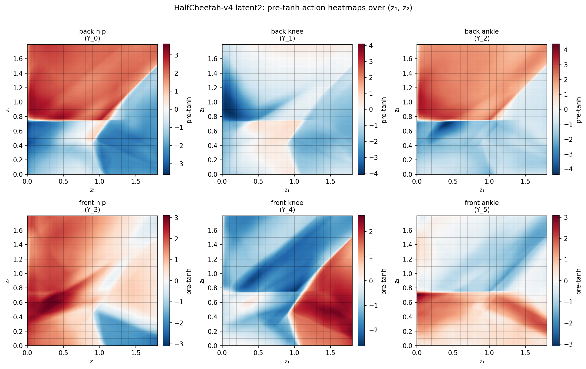
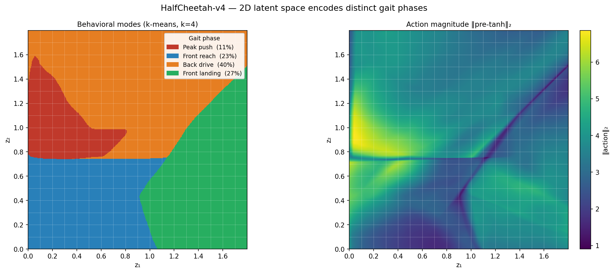

## Setup

```bash
conda create -n quant-env
conda activate quant-env

conda install -c conda-forge \
    mesa-libgl-cos7-x86_64 \
    mesa-libegl-cos7-x86_64 \
    libglvnd-cos7-x86_64

conda install -c conda-forge cvxpy cvxopt swiglpk
conda install -c gurobi gurobi
conda install -c mosek mosek

pip install -r requirements.txt
pip install --upgrade onnxscript

cd nnenum_package/nnenum
pip install .
cd ../..

cd nnenum_package/iq_verify
pip install .
cd ../..
```

**Alpha-Beta CROWN (optional, for comparison only):**
```bash
git clone --recursive https://github.com/Verified-Intelligence/alpha-beta-CROWN.git
cd alpha-beta-CROWN
pip install -r complete_verifier/requirements.txt
cd auto_LiRPA && pip install -e . && cd ..
pip install -e .
cd ..
```

**Note:** nnenum requires single-threaded BLAS. Always run with:
```bash
OPENBLAS_NUM_THREADS=1 OMP_NUM_THREADS=1 python <script>.py
```

If you see a `CXXABI_1.3.15` error:
```bash
export LD_LIBRARY_PATH=$CONDA_PREFIX/lib:$LD_LIBRARY_PATH
```

---

## Overview

This project demonstrates a **quantized bottleneck verification** approach for SAC policies trained with a low-dimensional latent bottleneck. The bottleneck splits the policy into two verifiable components:

1. **Encoder** (obs → N-D latent): small network, verified with nnenum (fast, complete)
2. **Latent controller** (N-D latent → action): verified by enumerating all reachable quantized latent cells via GPU lookup — no neural network verification needed

The key insight is structural: the encoder has only ~17 ReLU neurons to case-split on, while the latent controller's 512+ neurons are bypassed entirely by the quantized lookup. This gives >1000× speedup over alpha-beta CROWN on the same specs.

A secondary contribution is **deployment-fidelity**: because the latent controller is evaluated as-executed (including any weight quantization), the verification applies to the exact deployed model — not a float32 approximation.

### Architecture

```
Observation (17)
    → Linear(17, 16) → ReLU
    → Linear(16, N)  → ReLU      ← bottleneck (N-D latent)
    → Linear(N, 512) → ReLU
    → Linear(512, 512) → ReLU
    → Linear(512, 6)              ← pre-tanh actions
    → Tanh                        ← final actions (applied at runtime only)
```

For N=1: the encoder is 6 nnenum layers (17 ReLU neurons); the full network is 14 nnenum layers (17 + 1024 ReLU neurons). Running nnenum on the full network exceeds 30+ minutes on every spec and typically times out. Running on the encoder only takes ~1.5s.

---

## Training

### HalfCheetah-v4

```bash
# Latent dim 1 (arch [16, 1, 512, 512])
OPENBLAS_NUM_THREADS=1 OMP_NUM_THREADS=1 python train_sac.py \
    --env HalfCheetah-v4 --pi 16 1 512 512 --label arch0 --seed 0

# Latent dim 2
OPENBLAS_NUM_THREADS=1 OMP_NUM_THREADS=1 python train_sac.py \
    --env HalfCheetah-v4 --pi 16 2 512 512 --label latent2 --seed 0

# Latent dim 3
OPENBLAS_NUM_THREADS=1 OMP_NUM_THREADS=1 python train_sac.py \
    --env HalfCheetah-v4 --pi 16 3 512 512 --label latent3 --seed 0

# Standard [256, 256] baseline (no bottleneck)
OPENBLAS_NUM_THREADS=1 OMP_NUM_THREADS=1 python train_sac.py \
    --env HalfCheetah-v4 --pi 256 256 --label baseline --seed 0
```

### Hopper-v5

```bash
# Latent dim 2
OPENBLAS_NUM_THREADS=1 OMP_NUM_THREADS=1 python train_sac.py \
    --env Hopper-v5 --pi 16 2 512 512 --label latent2 --seed 0

# Latent dim 3
OPENBLAS_NUM_THREADS=1 OMP_NUM_THREADS=1 python train_sac.py \
    --env Hopper-v5 --pi 16 3 512 512 --label latent3 --seed 0

# Latent dim 4
OPENBLAS_NUM_THREADS=1 OMP_NUM_THREADS=1 python train_sac.py \
    --env Hopper-v5 --pi 16 4 512 512 --label latent4 --seed 0

# Standard [512, 512] baseline
OPENBLAS_NUM_THREADS=1 OMP_NUM_THREADS=1 python train_sac.py \
    --env Hopper-v5 --pi 512 512 --label baseline --seed 0
```


Each run saves to `sac_sweep_runs/<env>/<run_name>/seed0/`:
- `model.zip` — full SB3 SAC model
- `encoder.onnx` — encoder network (ONNX, ReLU-only, no Tanh)
- `encoder_full.pth`, `latent_controller_full.pth` — PyTorch modules
- `train_vec_norm.pkl` — VecNormalize running statistics
- `full_network.onnx` — full obs→action network for alpha-beta CROWN

All training scripts support checkpoint/resume: if `checkpoints/` contains `.zip` files from a prior run, training resumes from the latest checkpoint.

### Policy Performance

#### HalfCheetah-v4 (3M steps)

| Architecture | Mean return | Notes |
|---|---|---|
| `[512, 512]` baseline | 15,264 ± 47 | No bottleneck |
| `[16, 1, 512, 512]` latent1 | 6,683 ± 98 | |
| `[16, 2, 512, 512]` latent2 | 8,705 ± 1644 | |
| `[16, 3, 512, 512]` latent3 | 13,522 ± 59 | ~89% of baseline |

#### Hopper-v5 (3M steps)

| Architecture | Mean return | Notes |
|---|---|---|
| `[512, 512]` baseline | 4,117 ± 22 | No bottleneck |
| `[16, 1, 512, 512]` latent1 | 1,058 ± 1 | dim=1 too restrictive |
| `[16, 2, 512, 512]` latent2 | 976 ± 130 | dim=2 still struggles |
| `[16, 3, 512, 512]` latent3 | 3,538 ± 2 | ~86% of baseline |
| `[16, 4, 512, 512]` latent4 | 3,587 ± 12 | ~87% of baseline |

---

## Quantization

### Latent space quantization step

The latent space is quantized to a grid with step size `quant_step`. Steps are chosen as the largest value keeping quantized return within ~5% of clean:

| Architecture | Clean return | Quant step | Quantized return |
|---|---|---|---|
| HalfCheetah latent1 | 6,683 ± 98 | 0.02 | 6,595 ± 103 |
| HalfCheetah latent2 | 8,705 ± 1644 | 0.1 | 8,659 ± 94 |
| HalfCheetah latent3 | 13,522 ± 59 | 0.05 | 12,990 ± 159 |

### INT8 weight quantization

The latent controller can be weight-quantized to INT8 without retraining, and our verification method applies to the quantized model with no additional cost — the encoder enumeration is identical; only the controller lookup changes.

Quantization uses per-output-channel symmetric INT8 (weights rounded to nearest INT8 value, dequantized to float32 for inference; activations remain float32 throughout):

```bash
OPENBLAS_NUM_THREADS=1 OMP_NUM_THREADS=1 python quantize_and_verify.py
```

**Model size (HalfCheetah latent3 controller, 266,752 weight parameters):**

| Format | Storage | Size |
|---|---|---|
| float32 | 266,752 × 4 B | 1,046 KB |
| INT8 | 266,752 × 1 B + 1,030 scales × 4 B | 264.5 KB |
| Compression | | **3.95×** |

**Policy performance (20 episodes, HalfCheetah-v4):**

| Model | Mean return |
|---|---|
| float32 | 13,545 |
| INT8 (weight-only) | 13,512 |

**Verification results (specs 1–4, `complete=True`):**

| Spec | float32 | INT8 | Action diff (max) |
|---|---|---|---|
| spec_1 | SAFE | SAFE | — |
| spec_2 | SAFE | SAFE | — |
| spec_3 | SAFE | SAFE | — |
| spec_4 | SAFE | SAFE | — |
| **All specs** | | | max=3.39, mean=0.64 (pre-tanh) |

This demonstrates a key advantage over tools like alpha-beta CROWN: CROWN verifies the float32 model, and any safety guarantee it produces does not apply to the deployed quantized model. Our method verifies the exact deployed network at no extra cost.

---

## Verification

### Approach

Specs are written in VNN-LIB format with:
- **Inputs** `X_0..X_16`: VecNormalize-normalized observations
- **Outputs** `Y_0..Y_5`: pre-tanh actuator commands from the full policy network

**Verification procedure:**

1. Parse input bounds from VNN-LIB spec
2. Run nnenum on the encoder only → collect all output star sets
3. Convert each star to a bounding box; enumerate all reachable quantized latent cell centers
4. Evaluate `latent_ctrl(cell)` → pre-tanh actions for each cell (batched GPU)
5. Check action violation conditions from the spec

For N-dimensional latent the quantized grid is N-dimensional; cell count grows as O(R/q)^N.

### Soundness and Completeness

**Safe results are always sound:** if no cell in the enumerated grid violates the spec, no reachable quantized state can violate it — the grid over-covers the reachable set.

**Unsafe results** from the bounding-box overapproximation may be false positives. The `--complete` flag adds a lazy LP membership check: for each candidate violation cell it solves a joint LP against each encoder output star. The check **short-circuits at the first confirmed violation** — only one witness is needed.

```bash
OPENBLAS_NUM_THREADS=1 OMP_NUM_THREADS=1 python verify_policy.py \
    --run_dir sac_sweep_runs/HalfCheetah-v4/latent3/seed0 --all --complete
```

---

## HalfCheetah-v4 Specifications

### Observation / Action layout

| Index | Observation | | Index | Pre-tanh action |
|---|---|---|---|---|
| X_0 | torso height | | Y_0 | back hip |
| X_1 | torso pitch | | Y_1 | back knee |
| X_2–X_8 | joint angles | | Y_2 | back ankle |
| X_9 | forward velocity | | Y_3 | front hip |
| X_10–X_16 | joint angular velocities | | Y_4 | front knee |
| | | | Y_5 | front ankle |

**Specs 1–4** use a p20/p80 percentile input box from 50k baseline rollout steps, filtered to nominal running (xvel ∈ [0.5, 1.5], |pitch| ≤ 0.3, |height| ≤ 0.4). Thresholds set at PGD_max + 1.5 margin, verified safe via PGD with 40 restarts.

**Specs 5–8** use a narrower p32/p68 box so that α-β CROWN can terminate (not just timeout), enabling a direct timing comparison. Thresholds set via exhaustive cell enumeration.

**Specs 9–10** are provably unsafe specifications confirmed unsafe for all three networks (baseline continuous, bottleneck continuous, and quantized bottleneck). Thresholds set below cell_max so that violations are hidden in thin polytope preimages that PGD struggles to find.

| Spec | Box | Output checked | Threshold |
|---|---|---|---|
| spec_1 | p20/p80 | Y_4 (front knee) ≥ 5.07 | upper saturation |
| spec_2 | p20/p80 | Y_3 (front hip) ≥ 6.87 | upper saturation |
| spec_3 | p20/p80 | Y_5 (front ankle) ≥ 6.03 | upper saturation |
| spec_4 | p20/p80 | Y_1 (back knee) ≥ 6.37 | upper saturation |
| spec_5 | p32/p68 | Y_4 (front knee) ≥ 4.11 | upper saturation |
| spec_6 | p32/p68 | Y_3 (front hip) ≥ 7.65 | upper saturation |
| spec_7 | p32/p68 | Y_5 (front ankle) ≥ 4.62 | upper saturation |
| spec_8 | p32/p68 | Y_1 (back knee) ≥ 3.32 | upper saturation |
| spec_9 | p20/p80 | Y_0 (back hip) ≥ 4.90 | unsafe (1 reachable cell) |
| spec_10 | p20/p80 | Y_3 (front hip) ≥ 3.77 | unsafe (3 reachable cells) |

### HalfCheetah-v4 Verification Results

For bottleneck controllers, α-β CROWN verifies the full concatenated network (encoder + controller). "—" = not run; "timeout" = exceeded 1800s; "error" = nnenum OOM/crash. Speedup is relative to α-β CROWN time on the same controller. nnenum uses `set_control_settings()` (BRANCH_OVERAPPROX + LP contraction). Specs 1–8 verified SAFE; specs 9–10 verified UNSAFE.

| Spec | Box | CROWN baseline (s) | CROWN latent3 (s) | nnenum baseline (s) | nnenum latent3 (s) | Ours latent3 (s) | Speedup vs best |
|---|---|---|---|---|---|---|---|
| spec_1 | p20/p80 | timeout | timeout | error | safe (1142) | 4.57 | **250×** |
| spec_2 | p20/p80 | timeout | timeout | error | safe (1135) | 5.33 | **213×** |
| spec_3 | p20/p80 | timeout | timeout | timeout | safe (1110) | 5.51 | **201×** |
| spec_4 | p20/p80 | timeout | timeout | error | safe (1126) | 5.34 | **211×** |
| spec_5 | p32/p68 | 234.4 | 44.7 | error | safe (15.4) | 3.24 | **4.8×** |
| spec_6 | p32/p68 | 93.1 | 150.2 | error | safe (15.4) | 3.18 | **4.8×** |
| spec_7 | p32/p68 | timeout | 119.1 | timeout | safe (15.4) | 3.28 | **4.7×** |
| spec_8 | p32/p68 | timeout | timeout | timeout | safe (16.0) | 3.48 | **4.6×** |
| spec_9 | p20/p80 | unsafe (0.16) | unsafe (0.22) | timeout | unsafe (148) | 4.63 | — |
| spec_10 | p20/p80 | unsafe (0.50) | unsafe (0.06) | error | unsafe (477) | 4.63 | — |

### Why the speedup

- **α-β CROWN** must analyze the full obs→action network (17→512→512→6 for baseline). BaB generates millions of subdomains and cannot tighten bounds in time on most specs.
- **Our method** runs nnenum only on the encoder (~17 ReLU neurons, ~1.5s). The 1024-neuron latent controller is bypassed entirely via quantized lookup.
- α-β CROWN verifies the continuous float32 policy; our method verifies the exact deployed quantized policy. Both guarantees are valid for their respective runtime models.

---

## Hopper-v5 Specifications

### Observation / Action layout

| Index | Observation | | Index | Pre-tanh action |
|---|---|---|---|---|
| X_0 | torso z-position (height) | | Y_0 | thigh joint torque |
| X_1 | torso pitch angle | | Y_1 | leg joint torque |
| X_2–X_4 | thigh/leg/foot joint angles | | Y_2 | foot joint torque |
| X_5 | forward velocity (x) | | | |
| X_6 | z-velocity (vertical) | | | |
| X_7–X_10 | angular velocities | | | |

**Specs 1–4** use a p20/p80 box from baseline rollouts filtered to nominal hopping (xvel ∈ [0.5, 1.5], |height| ≤ 1.5, |pitch| ≤ 1.0). latent1/2 excluded (returns ~1000, produce out-of-distribution outputs on baseline observations). Thresholds set at PGD_max + 1.5 margin.

**Specs 5–8** use a p32/p68 box for tractable CROWN comparison.

**Specs 9–10** are provably unsafe specifications confirmed unsafe for all three networks (baseline continuous, bottleneck continuous, and quantized bottleneck). Thresholds chosen so PGD confirms violations on all networks.

| Spec | Box | Output checked | Threshold |
|---|---|---|---|
| spec_1 | p20/p80 | Y_0 (thigh) ≥ 8.12 | upper saturation |
| spec_2 | p20/p80 | Y_1 (leg) ≥ 17.46 | upper saturation |
| spec_3 | p20/p80 | Y_2 (foot) ≥ 13.13 | upper saturation |
| spec_4 | p20/p80 | any Y_i ≥ 17.46 | upper saturation |
| spec_5 | p32/p68 | Y_0 (thigh) ≥ 4.53 | upper saturation |
| spec_6 | p32/p68 | Y_1 (leg) ≥ 8.31 | upper saturation |
| spec_7 | p32/p68 | Y_2 (foot) ≥ 11.74 | upper saturation |
| spec_8 | p32/p68 | any Y_i ≥ 11.74 | upper saturation |
| spec_9 | p20/p80 | Y_0 (thigh) ≥ 3.90 | unsafe (all 3 networks) |
| spec_10 | p20/p80 | Y_1 (leg) ≥ 6.50 | unsafe (all 3 networks) |

### Hopper-v5 Quantization Step

| Architecture | Clean return | Quant step | Quantized return |
|---|---|---|---|
| latent3 | 3,538 ± 2 | 0.1 | 3,542 |
| latent4 | 3,587 ± 12 | 0.1 | 3,601 |

### Hopper-v5 Verification Results

For bottleneck controllers, α-β CROWN verifies the full concatenated network. Speedup computed against the α-β CROWN time for the same controller. nnenum uses `set_control_settings()`. Specs 1–8 verified SAFE; specs 9–10 verified UNSAFE.

| Spec | Box | CROWN baseline (s) | CROWN latent3 (s) | nnenum baseline (s) | nnenum latent3 (s) | Ours latent3 (s) | Speedup vs best |
|---|---|---|---|---|---|---|---|
| spec_1 | p20/p80 | timeout | timeout | error | error | 3.61 | **>499×** |
| spec_2 | p20/p80 | 613.7 | timeout | timeout | error | 3.56 | **172×** |
| spec_3 | p20/p80 | timeout | timeout | timeout | error | 3.74 | **>481×** |
| spec_4 | p20/p80 | timeout | timeout | error | error | 3.51 | **>513×** |
| spec_5 | p32/p68 | 129.3 | 199.9 | error | timeout | 3.38 | **38×** |
| spec_6 | p32/p68 | 82.9 | 31.2 | error | timeout | 3.37 | **9.3×** |
| spec_7 | p32/p68 | 30.3 | 11.6 | error | timeout | 3.38 | **3.4×** |
| spec_8 | p32/p68 | 42.1 | 24.9 | error | error | 3.38 | **7.4×** |
| spec_9 | p20/p80 | unsafe (0.07) | unsafe (0.10) | timeout | unsafe (762) | 3.93 | — |
| spec_10 | p20/p80 | unsafe (0.08) | unsafe (0.09) | error | error | 3.28 | — |

---

## Latent Space Visualization (HalfCheetah latent2)

```bash
python figures/latent_heatmaps.py --mode both
```





The 2D latent space organizes locomotion into four gait phases: **Peak push → Back drive → Front landing → Front reach**. Back hip (Y_0) and back ankle (Y_2) are highly correlated (r=0.94) and strongly anti-correlated with front knee (Y_4, r=−0.79), confirming the 2D space captures the dominant biomechanical axis.

---

## File Structure

```
.
├── train_sac.py                     # SAC training (bottleneck + baseline, all envs)
├── verify_policy.py                 # Core: encoder reachability + quantized lookup
├── quantize_and_verify.py           # INT8 weight quantization + verification comparison
├── eval_int8.py                     # Rollout performance: float32 vs INT8 controller
├── eval_quantized_policy.py         # Rollout performance: clean vs quantized latent step
├── compare_abcrown.py               # alpha-beta CROWN timing comparison
├── generate_halfcheetah_specs_v2.py # Safety specs 1–4 (p20/p80, universally safe)
├── generate_specs_5_8.py            # Safety specs 5–8 (p32/p68, CROWN-tractable)
├── gen_robustness_specs.py          # Local L-inf robustness specs
├── figures/
│   ├── jacobian_analysis.py             # Jacobian SVD + effective rank analysis
│   ├── mor_analysis.py                  # MOR: effective rank vs performance retention
│   ├── dmd_analysis.py                  # DMD global linear operator SVD comparison
│   ├── latent_heatmaps.py               # Latent space visualization
│   ├── jacobian_svd.png                 # SVD plots (HalfCheetah + Hopper)
│   ├── mor_analysis.png                 # MOR prediction figure
│   ├── latent2_action_heatmaps.png      # Per-action heatmaps over (z₁, z₂)
│   └── latent2_semantic.png             # Gait phase mode map (k-means, k=4)
├── specs/
│   ├── HalfCheetah-v4/
│   │   ├── spec_{1..4}.vnnlib          # Nominal safety specs (p20/p80)
│   │   ├── spec_{5..8}.vnnlib          # Tighter specs (p32/p68, CROWN-tractable)
│   │   └── rob_spec_*.vnnlib           # Local robustness specs
│   └── Hopper-v5/
│       └── spec_{1..4}.vnnlib
├── sac_sweep_runs/
│   ├── HalfCheetah-v4/
│   │   ├── arch0/seed0/               # latent dim 1
│   │   ├── latent2/seed0/             # latent dim 2
│   │   ├── latent3/seed0/             # latent dim 3
│   │   └── baseline/seed0/
│   └── Hopper-v5/
│       ├── arch0/seed0/
│       ├── latent2/seed0/
│       ├── latent3/seed0/
│       ├── latent4/seed0/
│       └── baseline/seed0/
├── deprecated/                        # Old scripts, kept for reference
├── nnenum_package/nnenum/             # Piecewise-linear reachability (nnenum)
└── nnenum_package/iq_verify/          # IQ-Verify (quantized reachability)
```
